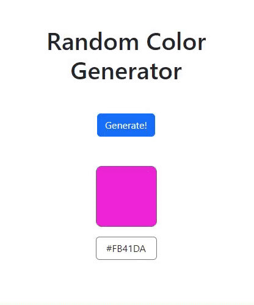

# Random Color Generator

## Demo

Below is a GIF demonstrating the **Random Color Generator** in action:

---

## Features

* **Responsive Design** powered by  **Bootstrap 5.3** .
* A button labeled **"Generate!"** that:
  * Displays a random color in a square box.
  * Shows the corresponding **hex color code** below the square.

## How It Works

1. Clicking the **"Generate!"** button triggers a JavaScript function.
2. The function:
   * Generates a random  **hexadecimal color code** .
   * Updates the square's background color with the new color.
   * Displays the hex code in a styled box below the square.

## Technologies Used

* **HTML** : To structure the page.
* **CSS & Bootstrap 5.3** : For styling and responsive design.
* Used Bootstrap classes for buttons, layout, and alignment.
* **JavaScript** : For generating random colors and dynamically updating the UI.
